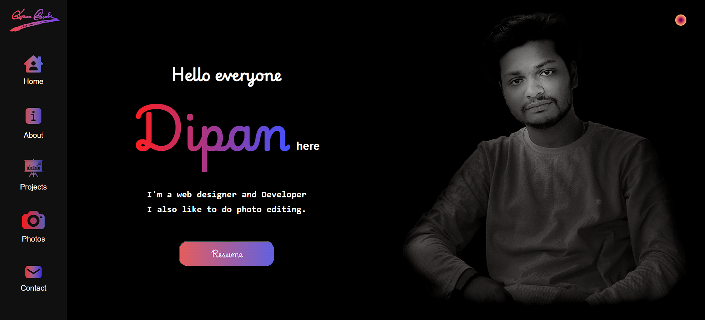

# My Portfolio App

A personal portfolio website showcasing my projects, skills, and contact information. Built with React and Vite, this application provides a clean and responsive way to present my work to potential employers and collaborators.

---

## 🔍 Preview

-   Live - [https://dipan46.github.io/my-portfolio-app/](https://dipan46.github.io/my-portfolio-app/)

## ✨ Features

-   🏠 **Home Section** – Introduction and welcome
-   👋 **About Section** – Details about me, skills, and experience
-   💻 **Projects Section** – Showcase of personal and professional projects
-   📸 **Photos Section** – A collection of relevant images or work
-   ✉️ **Contact/Footer** – Information for getting in touch
-   📱 **Responsive Design** – Optimized for various screen sizes
-   导航 **Navigation** – Easy access to different sections of the portfolio

---

## 🛠️ Technologies Used

-   **React** – JavaScript library for building UIs
-   **Vite** - Fast frontend build tool
-   **HTML & CSS** – For structure and styling (potentially with CSS Modules based on file names)
-   **JavaScript (ES6+)** – Application logic

---

## 📸 Preview

_Example UI of the app in action:_



---

## 🚀 Getting Started

### Prerequisites

-   [Node.js](https://nodejs.org/) (comes with `npm`)

### Installation

1. **Clone the repository**:

    ```bash
    git clone [Your Repository URL Here]
    cd my-portfolio-app

    ```

2. **Install dependencies**:

    ```bash
    npm install
    ```

### Running the app

```bash
npm run dev
```

Visit [http://localhost:5173](http://localhost:5173) in your browser.

---

## 📂 Project Structure

```
my-portfolio-app/
├── preview/
│   └── prev.png
├── src/
│   ├── App.css
│   ├── App.jsx
│   ├── assets/
│   │   ├── icon/
│   │   │   ├── 46.ico
│   │   │   ├── about.png
│   │   │   ├── about2.png
│   │   │   ├── about3.png
│   │   │   ├── camera.png
│   │   │   ├── camera3.png
│   │   │   ├── contact.png
│   │   │   ├── contact2.png
│   │   │   ├── contact3.png
│   │   │   ├── girhub.png
│   │   │   ├── gmail.png
│   │   │   ├── house.png
│   │   │   ├── house2.png
│   │   │   ├── house3.png
│   │   │   ├── instagram.png
│   │   │   ├── internship.png
│   │   │   ├── internship1.png
│   │   │   ├── internship2.png
│   │   │   ├── linkedin.png
│   │   │   ├── project.png
│   │   │   ├── project2.png
│   │   │   └── project3.png
│   │   ├── Image/
│   │   │   ├── backyeard.jpg
│   │   │   ├── Bus.jpg
│   │   │   ├── BW.png
│   │   │   ├── BW2.png
│   │   │   ├── bwp.png
│   │   │   ├── dog.jpg
│   │   │   ├── Fire.jpg
│   │   │   ├── ganga.jpg
│   │   │   ├── ground.jpg
│   │   │   ├── howraBridge.jpg
│   │   │   ├── IMG-20240303-WA0177(BW).png
│   │   │   ├── IMG-20240303-WA0177.jpg
│   │   │   ├── IMG-20240303-WA0177.png
│   │   │   ├── patkathi.jpg
│   │   │   ├── pen.jpg
│   │   │   ├── Sign.png
│   │   │   ├── Sign1.png
│   │   │   ├── Sign2.png
│   │   │   └── sunset.jpg
│   │   ├── internship/
│   │   │   ├── BI.jpg
│   │   │   ├── cld.jpg
│   │   │   ├── GAD.jpg
│   │   │   ├── lr.jpg
│   │   │   └── mcWD.jpg
│   │   └── projects/
│   │       ├── AWR.png
│   │       ├── ens.png
│   │       ├── fa.png
│   │       ├── hh.png
│   │       ├── kpr.png
│   │       ├── pm.png
│   │       ├── salesdata.png
│   │       ├── sc.png
│   │       ├── texted.png
│   │       ├── todo.png
│   │       ├── ts.png
│   │       └── TSM.png
│   ├── components/
│   │   ├── About.jsx
│   │   ├── Footer.jsx
│   │   ├── Footer.module.css
│   │   ├── Home.jsx
│   │   ├── Home.module.css
│   │   ├── Navbar.jsx
│   │   ├── Navbar.module.css
│   │   ├── Photos.jsx
│   │   ├── Photos.module.css
│   │   ├── Projects.jsx
│   │   └── Projects.module.css
│   ├── index.css
│   ├── main.jsx
│   └── utils/
│       ├── card.json
│       └── photos.json
├── eslint.config.js
├── index.html
├── package-lock.json
├── package.json
└── vite.config.js


```

---

## 💡 Learnings & Concepts Demonstrated

-   🧠 **Component-Based Architecture**
-   🧩 **Component Composition**
-   🧬 **Props Handling**
-   👁️ **Conditional Rendering**
-   🖱 **Event Handling**
-   📱 **Responsive Design**
-   📦 **Module CSS** (based on file names)

---

## 🤝 Contributing

Feel free to fork this repo, make changes, and submit pull requests. All contributions are appreciated and welcome!

---

## 📄 License

This project is open source and available under the [MIT License](LICENSE).

---

## 👨‍💻 Author

Made with ❤️ by [[Dipan46](https://github.com/Dipan46)]
